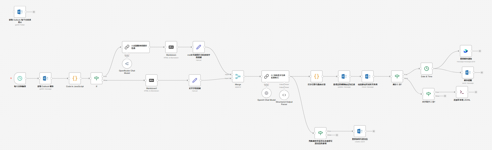
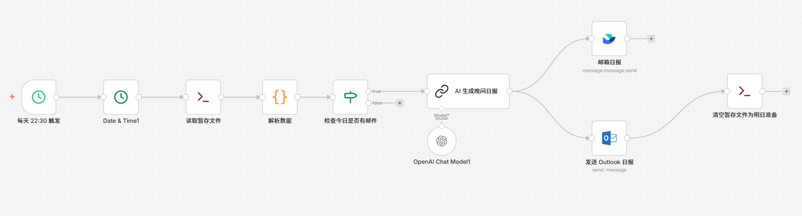

# 🎓 EduEmail AI Agent (基于 n8n 的高校教育邮箱全自动助理)
## 📝 简介 (Introduction)
每天被学校的讲座通知、招聘宣讲、社团活动和无用的推销邮件狂轰滥炸？错过重要的缴费截止日期？懒得手动把讲座时间添加到日历？

EduEmail AI Agent 是一个基于 n8n 构建的自动化工作流。它就像你的专属私人秘书，全天候 24 小时静默运行，帮你阅读所有的 .edu 教育邮箱邮件。它不仅能看懂文字，还能自动提取附件海报（图片）中的信息，结合大语言模型（LLM）的超强语义分析能力，对邮件进行智能打分、精准分类，同时包括一个模块可以像插座一样方便输入自己的个人对邮件的个性化偏好，并将重要的活动时间自动写入你的 Outlook 日历。

## 🎯 适用人群与场景
适用人群：深受学校群发邮件困扰的大学生、研究生（特别是 CUHK 等高校学生，预设了高度适配的过滤规则）。

使用场景：
- 垃圾邮件隔离：自动识别纯灌水邮件并扔进垃圾文件夹。
- 核心痛点聚焦：遇到“交学费”、“交作业”、“考试”等字眼，最高优先级强提醒！
- 求职与深造：精准捕捉实习、秋招宣讲、海外交流（Exchange/Summer School）、奖学金补贴等信息，分拣到专属文件夹。
- 时间管理：从附带的宣讲会海报中提取“时间与地点”，全自动在你的日历上创建日程。

## ✨ 核心特性 (Features)
本工作流深度为学生时代教育邮箱定制，包含以下特性：
- 🏫 高校群发机构识别：区分真正的私人教授来信与学校官方系统群发（如 do_not_reply@...，各学院 newsletter）。
- 💰 学业/费用优先：只要邮件涉及“交学费”、“考试”、“Midterm/Final”，无论发件人是谁，都视为最高优先级。
- 🖼️ 多模态海报解析：自动过滤提取图片附件，交给视觉大模型读取时间地点，再与邮件正文融合。
- 📅 全自动日程表创建：将模糊时间（如“下周三下午”）转换为严谨的带时区格式，并写入 Outlook 日历。
- 💎 容错路由设计：有图读图，没图读字，兼容批量邮件并发，尽量避免崩溃。

## 📊 工作流截图示意
下图是当前仓库中已经提供的两个 n8n 工作流：

## 🚀 极简部署指南 (How to Use)
阶段一：环境准备（Docker + n8n）
1. 安装 Docker Desktop（Win/Mac 均可）。
2. 启动 n8n，例如：
   docker run -it --rm --name n8n -p 5678:5678 -v n8n_data:/home/node/.n8n --restart always docker.n8n.io/n8nio/n8n
3. 打开 http://localhost:5678，设置管理员账号。

阶段二：导入工作流
1. 将本仓库中的 n8n 工作流 JSON 文件下载到本地。
2. 在 n8n 中选择 “Import from File” 导入。

阶段三：关键节点配置
- 配置 Microsoft Outlook OAuth2 凭证，用于读取邮件 + 写入日历。
- 配置 AI 模型 API Key（如 OpenAI / 阿里云千问）。
- 在打分与路由 Code 节点里，替换为你自己邮箱的真实 Folder ID。
- 在每日邮件日报的工作流中，一定要点击右上角的设置，里面有时区需要设置为你所在的地区，否则他不会按照您的时区到点触发的，比如你所处中国，可以设置为Asia/Shanghai

✅ 已完成特性
- [x] HTML 邮件转 Markdown 降噪
- [x] 附件图片识别 + 统一命名 + 交给视觉大模型
- [x] 邮件正文与海报内容合并处理
- [x] 分层打分引擎（私人/机构、考试、求职、出国、补贴等维度）
- [x] 时区与日历字段的鲁棒性处理

🚧 待办事项
- [ ] 优化 Prompt，使其更贴合特定高校语境（如 CUHK）
- [ ] 与 M-project 记忆库对接，实现真正的个性化长期偏好
- [ ] 增加非 Outlook（如 Gmail 教育版）的适配方案

如果这个工作流对你的今日邮箱减负有所帮助，也欢迎在 GitHub 上为仓库点一颗 ⭐。
